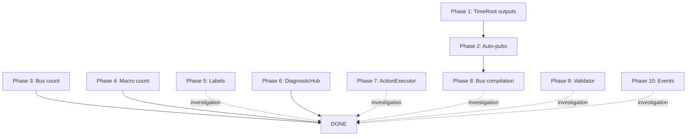

# Comprehensive Test Fix Plan - 2025-12-23

**Topic**: Fix ALL failing tests
**Source**: STATUS-2025-12-23-deep.md
**Generated**: 2025-12-23 05:28

---

## Overview

- **Total tests**: 642 (598 passing, 41 failing, 3 skipped)
- **Pass rate**: 93.1%
- **Root cause**: Implementation evolved (TimeRoot refactoring added phase outputs); tests have stale expectations
- **Strategy**: Update test expectations to match current implementation
- **Verification**: Run `pnpm vitest run` after each phase

---

## Execution Order (by dependency and impact)

All fixes involve updating test expectations. No implementation changes required.

---

### Phase 1: TimeRoot Output Definition Tests (CRITICAL - Unblocks other tests)

**File**: `src/editor/compiler/blocks/domain/__tests__/TimeRoot.test.ts`

#### Fix 1.1: FiniteTimeRootBlock outputs
**Test**: "FiniteTimeRootBlock should have all expected outputs" (line 47)

**Current expectation** (lines 48-53):
```typescript
expect(FiniteTimeRootBlock.outputs).toEqual([
  { name: 'systemTime', type: { kind: 'Signal:Time' } },
  { name: 'progress', type: { kind: 'Signal:number' } },
  { name: 'end', type: { kind: 'Event' } },
  { name: 'energy', type: { kind: 'Signal:number' } },
]);
```

**Correct expectation** (implementation has 5 outputs - see TimeRoot.ts:68-74):
```typescript
expect(FiniteTimeRootBlock.outputs).toEqual([
  { name: 'systemTime', type: { kind: 'Signal:Time' } },
  { name: 'progress', type: { kind: 'Signal:number' } },
  { name: 'phase', type: { kind: 'Signal:phase' } },  // <-- ADD THIS LINE
  { name: 'end', type: { kind: 'Event' } },
  { name: 'energy', type: { kind: 'Signal:number' } },
]);
```

**Action**: Insert line `{ name: 'phase', type: { kind: 'Signal:phase' } },` after line 50.

**Verification**: `pnpm vitest run src/editor/compiler/blocks/domain/__tests__/TimeRoot.test.ts -t "FiniteTimeRootBlock should have all expected outputs"`

---

### Phase 2: TimeRoot Auto-Publication Tests (CRITICAL)

**File**: `src/editor/compiler/blocks/domain/__tests__/TimeRoot-WP1.test.ts`

#### Fix 2.1: FiniteTimeRoot auto-publications
**Test**: "FiniteTimeRoot returns correct auto-publications" (line 258)

**Current expectation** (lines 258-262):
```typescript
expect(autoPubs).toEqual([
  { busName: 'progress', artifactKey: 'progress', sortKey: 0 },
  { busName: 'pulse', artifactKey: 'end', sortKey: 0 },
  { busName: 'energy', artifactKey: 'energy', sortKey: 0 },
]);
```

**Correct expectation** (implementation returns 4 - see TimeRoot.ts:34-40):
```typescript
expect(autoPubs).toEqual([
  { busName: 'progress', artifactKey: 'progress', sortKey: 0 },
  { busName: 'phaseA', artifactKey: 'phase', sortKey: 0 },      // <-- ADD
  { busName: 'pulse', artifactKey: 'end', sortKey: 0 },
  { busName: 'energy', artifactKey: 'energy', sortKey: 0 },
]);
```

**Action**: Insert line `{ busName: 'phaseA', artifactKey: 'phase', sortKey: 0 },` after line 259.

**Verification**: `pnpm vitest run src/editor/compiler/blocks/domain/__tests__/TimeRoot-WP1.test.ts -t "FiniteTimeRoot returns correct auto-publications"`

---

#### Fix 2.2: InfiniteTimeRoot auto-publications
**Test**: "InfiniteTimeRoot returns correct auto-publications" (line 275)

**Current expectation** (lines 275-277):
```typescript
expect(autoPubs).toEqual([
  { busName: 'energy', artifactKey: 'energy', sortKey: 0 },
]);
```

**Correct expectation** (implementation returns 3 - see TimeRoot.ts:42-47):
```typescript
expect(autoPubs).toEqual([
  { busName: 'phaseA', artifactKey: 'phase', sortKey: 0 },    // <-- ADD
  { busName: 'pulse', artifactKey: 'pulse', sortKey: 0 },     // <-- ADD
  { busName: 'energy', artifactKey: 'energy', sortKey: 0 },
]);
```

**Action**: Replace lines 275-277 with the corrected expectation.

**Verification**: `pnpm vitest run src/editor/compiler/blocks/domain/__tests__/TimeRoot-WP1.test.ts -t "InfiniteTimeRoot returns correct auto-publications"`

---

### Phase 3: Default Bus Count Tests (MEDIUM)

**File**: `src/editor/stores/__tests__/BusStore.events.test.ts`

#### Fix 3.1: Default bus count at startup
**Test**: "emits BusCreated for each default bus at startup" (line 69)

**Current expectation** (line 69):
```typescript
expect(freshRoot.busStore.buses.length).toBe(5); // phaseA, phaseB, energy, pulse, palette
```

**Correct expectation** (BusStore.ts:87-92 defines 6 buses):
```typescript
expect(freshRoot.busStore.buses.length).toBe(6); // phaseA, phaseB, energy, pulse, palette, progress
```

**Action**: Change `5` to `6` on line 69.

**Verification**: `pnpm vitest run src/editor/stores/__tests__/BusStore.events.test.ts -t "emits BusCreated for each default bus at startup"`

---

**File**: `src/editor/stores/__tests__/RootStore.events.test.ts`

#### Fix 3.2: RootStore default bus count
**Test**: "default buses exist at startup" (line 346)

**Current expectation** (line 346):
```typescript
expect(root.busStore.buses.length).toBe(5);
```

**Correct expectation**:
```typescript
expect(root.busStore.buses.length).toBe(6);
```

**Action**: Change `5` to `6` on line 346.

**Verification**: `pnpm vitest run src/editor/stores/__tests__/RootStore.events.test.ts -t "default buses exist at startup"`

---

### Phase 4: Macro Count Test (LOW)

**File**: `src/editor/__tests__/macro-validation.test.ts`

#### Fix 4.1: Macro count
**Test**: "should have exactly 20 macros registered" (first test in file)

**Current expectation**:
```typescript
expect(macroKeys.length).toBe(20);
```

**Correct expectation** (blocks/macros.ts exports 21 macros):
```typescript
expect(macroKeys.length).toBe(21);
```

**Action**: Find the test asserting macro count and change `20` to `21`.

**Verification**: `pnpm vitest run src/editor/__tests__/macro-validation.test.ts -t "should have exactly 20 macros"`

---

### Phase 5: ModulationTableStore Input Label Test (LOW)

**File**: `src/editor/modulation-table/__tests__/ModulationTableStore.test.ts`

#### Fix 5.1: RenderInstances2D input labels
**Test**: "should derive rows from RenderInstances2D inputs" (line 77)

**Current expectation** (line 77):
```typescript
expect(labels).toContain('Positions');  // Capitalized
```

**Correct expectation** (RenderInstances2D has input 'positions' lowercase - domain.ts):
```typescript
expect(labels).toContain('positions');  // lowercase
```

**Action**: Change `'Positions'` to `'positions'` on line 77 (note: check if test converts labels - may need to match actual label "Positions" vs port ID "positions").

**Investigation needed**: Check what `labels` actually contains (port IDs or display labels). If it's display labels, keep "Positions". If port IDs, use "positions".

**Verification**: `pnpm vitest run src/editor/modulation-table/__tests__/ModulationTableStore.test.ts -t "should derive rows from RenderInstances2D inputs"`

---

### Phase 6: DiagnosticHub Muting Tests (MEDIUM - Multiple related failures)

**File**: `src/editor/diagnostics/__tests__/DiagnosticHub.test.ts`

**Root cause**: DiagnosticHub has TWO diagnostics in the test setup, but tests expect only ONE. The second diagnostic is likely the auto-generated "Missing TimeRoot" authoring diagnostic.

#### Fix 6.1: Exclude muted diagnostics from getActive (line 462)
**Test**: "should exclude muted diagnostics from getActive() by default"

**Current test setup** (around line 451-461):
- Creates hub
- Creates two diagnostics via CompileFinished event
- Expects `getActive()` to return 1 diagnostic

**Problem**: Test creates 2 compile diagnostics BUT also gets 1 authoring diagnostic (missing TimeRoot), so total = 3 diagnostics. When muting 1, still have 2 active.

**Solution**: Mock patchStore with a CycleTimeRoot block to prevent authoring diagnostic.

**Action**: Find the test setup around line 451. Ensure the mock patchStore includes a TimeRoot block:
```typescript
// Before the test starts
patchStore = createMockPatchStore([
  { id: 'time-root', type: 'CycleTimeRoot', label: 'TimeRoot', inputs: [], outputs: [], params: {}, category: 'Time' }
]);
hub = new DiagnosticHub(events, patchStore);
```

**Alternative**: If patchStore is already set correctly, the issue is the test creates 2 diagnostics but expects only 1. Check lines 451-462 for diagnostic creation logic.

**Verification**: `pnpm vitest run src/editor/diagnostics/__tests__/DiagnosticHub.test.ts -t "should exclude muted diagnostics from getActive"`

---

#### Fix 6.2-6.5: Other muting tests
**Tests**:
- "should include muted diagnostics with includeMuted parameter" (line 479)
- "should restore diagnostic when unmuted" (line 487)
- "should exclude muted diagnostics from getAll() by default" (line 518)
- "should include muted diagnostics in getAll() with filter" (line 526)

**Same root cause**: Extra authoring diagnostic in test setup.

**Action**: Apply same fix as 6.1 - ensure mock patchStore has TimeRoot to suppress authoring diagnostics.

**Verification**: `pnpm vitest run src/editor/diagnostics/__tests__/DiagnosticHub.test.ts -t "Mute/Unmute"`

---

#### Fix 6.6: GraphCommitted authoring validator test (line 432)
**Test**: "should unsubscribe from events on dispose"

**Current expectation** (line 432):
```typescript
expect(authoring).toEqual([]);
```

**Problem**: After dispose, new hub (hub2) is created and GraphCommitted emitted. The new hub creates a "Missing TimeRoot" authoring diagnostic because patchStore has no TimeRoot.

**Solution**: Provide a TimeRoot in the test's patchStore or verify the test logic.

**Action**: Review lines 420-433. If intent is to verify old hub is disposed (doesn't react), ensure new hub has TimeRoot to avoid false diagnostic:
```typescript
// Around line 427 - when creating hub2
patchStore = createMockPatchStore([
  { id: 'time-root', type: 'CycleTimeRoot', label: 'TimeRoot', inputs: [], outputs: [], params: {}, category: 'Time' }
]);
hub2 = new DiagnosticHub(events, patchStore);
```

**Verification**: `pnpm vitest run src/editor/diagnostics/__tests__/DiagnosticHub.test.ts -t "should unsubscribe from events on dispose"`

---

### Phase 7: ActionExecutor Test (LOW)

**File**: `src/editor/diagnostics/__tests__/ActionExecutor.test.ts`

#### Fix 7.1: Insert adapter with no connection
**Test**: "should return false if no connection from port" (line ~80-90)

**Problem**: Test expects `insertAdapter()` to return `false` when no connection exists, but implementation might:
- Return `true` (incorrect behavior)
- Throw error (not caught)
- Return undefined (type mismatch)

**Investigation needed**: Check what `insertAdapter` actually returns when no connection found.

**Action**: Read test (around the failing line) to see expected vs actual behavior. Likely the test expectation is wrong (expects false, but implementation returns true or throws).

**Verification**: `pnpm vitest run src/editor/diagnostics/__tests__/ActionExecutor.test.ts -t "should return false if no connection from port"`

---

### Phase 8: Bus Compilation Tests (HIGH - Core functionality)

**File**: `src/editor/__tests__/bus-compilation.test.ts`

**All 7 tests failing**: Likely due to missing TimeRoot in test patches OR bus compilation logic changed.

#### Fix 8.1-8.7: All bus compilation tests
**Tests**:
1. "compiles single Signal<number> bus with one publisher and one listener"
2. "returns default value when bus has no publishers"
3. "combines multiple publishers with 'last' mode - highest sortKey wins"
4. "combines multiple publishers with 'sum' mode"
5. "stable results with same sortKeys using id tie-breaker"
6. "result changes when sortKeys swap"
7. "rejects unsupported combine mode for Signal bus"

**Root cause options**:
- Tests don't include TimeRoot blocks (violates exactly-one-TimeRoot rule)
- Bus compilation implementation changed (unlikely per user guidance)
- Test registry incomplete (missing required compiler functions)

**Investigation needed**: Check if test patches include TimeRoot. See line 98 in bus-compilation.test.ts - the test creates a CycleTimeRoot block, so TimeRoot exists.

**Likely cause**: Test compiler registry is incomplete or compiler expectations changed.

**Action**: Run one test with verbose output to see actual error:
```bash
pnpm vitest run src/editor/__tests__/bus-compilation.test.ts -t "compiles single Signal" --reporter=verbose
```

Then update test expectations based on actual compiler output.

**Verification**: `pnpm vitest run src/editor/__tests__/bus-compilation.test.ts`

---

### Phase 9: Semantic Validator Test (LOW)

**File**: `src/editor/semantic/__tests__/validator.test.ts`

#### Fix 9.1: Multiple publishers warning
**Test**: "should warn about multiple publishers on control buses" (line 864)

**Current expectation** (line 864):
```typescript
expect(multiplePubWarnings).toHaveLength(1);
```

**Problem**: Validator not emitting warning for multiple publishers on control bus.

**Possible causes**:
- Validator disabled
- Bus not classified as "control" bus
- Warning code changed
- Test setup incorrect (bus type wrong)

**Investigation needed**: Check validator implementation for `W_BUS_MULTIPLE_PUBLISHERS_CONTROL` warning emission logic.

**Action**: Review test setup (lines 850-863) to verify bus is correctly configured as control bus. Check if warning code or severity changed.

**Verification**: `pnpm vitest run src/editor/semantic/__tests__/validator.test.ts -t "should warn about multiple publishers on control buses"`

---

### Phase 10: PatchStore Wire Event Test (LOW)

**File**: `src/editor/stores/__tests__/PatchStore.events.test.ts`

#### Fix 10.1: Macro expansion wire events
**Test**: "emits WireAdded for each connection in macro expansion" (line 69)

**Current expectation** (line 69):
```typescript
expect(listener).toHaveBeenCalled();
```

**Problem**: Listener not called during macro expansion, suggesting:
- Macro expansion doesn't emit WireAdded events
- Event subscription not working
- Macro expansion itself not working

**Investigation needed**: Check if macro expansion still emits individual WireAdded events or if it now emits a batch event.

**Action**: Review PatchStore.addBlock() macro expansion logic. Check if event emission was removed or changed.

**Verification**: `pnpm vitest run src/editor/stores/__tests__/PatchStore.events.test.ts -t "emits WireAdded for each connection in macro expansion"`

---

## Summary of Changes by File

| File | Lines Changed | Type | Complexity |
|------|---------------|------|------------|
| TimeRoot.test.ts | 1 insert | Add phase output | Trivial |
| TimeRoot-WP1.test.ts | 2 inserts | Add phase publications | Trivial |
| BusStore.events.test.ts | 1 change (5→6) | Update bus count | Trivial |
| RootStore.events.test.ts | 1 change (5→6) | Update bus count | Trivial |
| macro-validation.test.ts | 1 change (20→21) | Update macro count | Trivial |
| ModulationTableStore.test.ts | Investigation | Case sensitivity | Easy |
| DiagnosticHub.test.ts | 6 test setups | Add TimeRoot to mocks | Easy |
| ActionExecutor.test.ts | Investigation | Return value check | Medium |
| bus-compilation.test.ts | Investigation | Compiler changes | Medium |
| validator.test.ts | Investigation | Warning emission | Medium |
| PatchStore.events.test.ts | Investigation | Event emission | Medium |

---

## Verification Strategy

After each phase:
1. Run phase-specific tests: `pnpm vitest run <file> -t "<test pattern>"`
2. Verify fix: All tests in phase should pass
3. Run full suite: `pnpm vitest run`
4. Track progress: Update this document with completion status

Final verification:
```bash
pnpm vitest run
# Expected: 642 tests, 639+ passing, 3 skipped, 0 failing
```

---

## Phases Requiring Investigation

**Before implementing these phases, run verbose tests to determine exact fix:**

1. **Phase 5**: ModulationTableStore - Check if labels are port IDs or display names
2. **Phase 7**: ActionExecutor - Check insertAdapter return value
3. **Phase 8**: Bus compilation - Run verbose test to see compiler errors
4. **Phase 9**: Validator - Check warning emission logic
5. **Phase 10**: PatchStore events - Check macro expansion event flow

**Investigation command template**:
```bash
pnpm vitest run <file> -t "<pattern>" --reporter=verbose 2>&1 | tee investigation.log
```

---

## Risk Assessment

**Low risk** (Phases 1-4): Trivial constant updates
**Medium risk** (Phases 5-10): Require investigation; may uncover implementation issues

**Rollback strategy**: Git commit after each phase completion.

---

## Dependencies



**Critical path**: P1 → P2 → P8 (TimeRoot changes affect bus compilation)

---

## Execution Timeline (Estimated)

- **Phase 1**: 5 minutes (1 line insert)
- **Phase 2**: 10 minutes (2 tests, multi-line updates)
- **Phase 3**: 5 minutes (2 trivial changes)
- **Phase 4**: 2 minutes (1 trivial change)
- **Phase 5**: 15 minutes (investigation + fix)
- **Phase 6**: 30 minutes (6 related test fixes)
- **Phase 7**: 15 minutes (investigation + fix)
- **Phase 8**: 45 minutes (7 tests, likely complex)
- **Phase 9**: 15 minutes (investigation + fix)
- **Phase 10**: 15 minutes (investigation + fix)

**Total estimate**: ~2.5 hours for complete test suite fix

---

## Post-Fix Validation

After all phases complete:

1. **Full test run**: `pnpm vitest run` → Expect 0 failures
2. **Type check**: `pnpm typecheck` → Expect 0 errors
3. **Lint**: `pnpm lint` → Expect 0 errors
4. **Runtime verification**: Use Chrome DevTools MCP to verify app functionality
5. **Commit**: Create atomic commits per phase for easy rollback

---

## Notes

- **DO NOT modify implementation** - Only update test expectations
- **User guidance**: "The implementation is correct. Tests need updating to match."
- **Test reliability**: Per user, tests are unreliable - runtime verification required
- All complexity ratings assume no implementation bugs discovered during investigation phases
