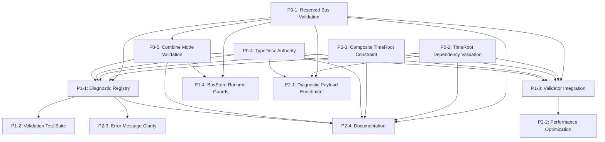

# WP0: Lock the Contracts - Implementation Plan

**Generated**: 2025-12-21 15:16:52
**Source**: STATUS-20251221-133500.md
**Topic**: wp0-lock-contracts
**Status**: 35% complete → Target: 100%

---

## Executive Summary

WP0 establishes compile-time validation invariants that all subsequent work packages depend on. Current implementation has TimeRoot constraint validation (complete) but lacks reserved bus enforcement, TimeRoot dependency checking, and composite constraints.

**Current State** (from STATUS-20251221-133500.md):
- ✅ Exactly-one-TimeRoot validation complete
- ✅ TypeDesc system exists but not authoritative
- ⚠️ Reserved buses created but not enforced
- ❌ TimeRoot upstream dependency validation missing
- ❌ Composite TimeRoot constraint missing

**Total Work Items**: 13 (P0: 5, P1: 4, P2: 4)

**Estimated Complexity**: Medium-High (3-4 weeks, complexity-based)

**Critical Path**: P0 items must complete before WP1 can begin.

---

## Backlog by Priority

### P0 (Critical) - Foundation Contracts

These are blocking requirements for WP1 (TimeRoot + TimeModel + Player Rewrite).

---

## P0-1: Reserved Bus Type Validation

**Status**: Not Started
**Effort**: Medium (3-5 days complexity)
**Dependencies**: None
**Spec Reference**: `03-Buses.md` lines 24-85 • **Status Reference**: STATUS-20251221-133500.md lines 103-141

### Description

Enforce that reserved bus names (`phaseA`, `phaseB`, `pulse`, `energy`, `progress`, `palette`) have canonical TypeDesc contracts. If a patch defines a reserved bus with incorrect type, emit compile error. Reserved buses are structural contracts between TimeRoot, UI, and patches - type mismatches break the system.

**Current Gap**: `BusStore.createBus()` only checks duplicate names (line 132), not type contracts. Users can create `phaseA` with wrong type.

### Acceptance Criteria (REQUIRED)

- [ ] Create `RESERVED_BUS_REGISTRY` constant mapping name → canonical TypeDesc + combineMode
- [ ] Add `validateReservedBusType(bus: Bus): Diagnostic | null` function to validator
- [ ] Emit `E_RESERVED_BUS_TYPE_MISMATCH` if reserved bus has wrong world/domain
- [ ] Emit `E_RESERVED_BUS_COMBINE_MODE_MISMATCH` if reserved bus has wrong combineMode
- [ ] Integrate validation into `Validator.validateAll()` as new rule
- [ ] BusStore prevents creating reserved buses with wrong types (runtime guard)
- [ ] Unit test: attempt to create `phaseA` as Signal\<number\> → error
- [ ] Unit test: create `phaseA` as Signal\<phase\> with combineMode='sum' → error
- [ ] Unit test: create `phaseA` as Signal\<phase\> with combineMode='last' → success
- [ ] E2E test: Golden Patch validates reserved buses correctly

### Technical Notes

**Reserved Bus Contracts** (from `03-Buses.md`):
```typescript
const RESERVED_BUS_REGISTRY: Record<string, {
  typeDesc: TypeDesc;
  combineMode: BusCombineMode;
  requiredBy?: 'CycleTimeRoot' | 'FiniteTimeRoot';
}> = {
  phaseA: {
    typeDesc: { world: 'signal', domain: 'phase', category: 'core', busEligible: true, semantics: 'primary' },
    combineMode: 'last',
    requiredBy: 'CycleTimeRoot'
  },
  phaseB: {
    typeDesc: { world: 'signal', domain: 'phase', category: 'core', busEligible: true, semantics: 'secondary' },
    combineMode: 'last'
  },
  pulse: {
    typeDesc: { world: 'special', domain: 'event', category: 'core', busEligible: true, semantics: 'pulse' },
    combineMode: 'or',
    requiredBy: 'CycleTimeRoot'
  },
  energy: {
    typeDesc: { world: 'signal', domain: 'number', category: 'core', busEligible: true, semantics: 'energy' },
    combineMode: 'sum'
  },
  progress: {
    typeDesc: { world: 'signal', domain: 'unit', category: 'core', busEligible: true, semantics: 'progress' },
    combineMode: 'last',
    requiredBy: 'FiniteTimeRoot'
  },
  palette: {
    typeDesc: { world: 'signal', domain: 'color', category: 'core', busEligible: true },
    combineMode: 'last'
  }
};
```

**Validation Logic**:
1. Check if `bus.name` is in `RESERVED_BUS_REGISTRY`
2. If reserved, validate:
   - `bus.type.world === spec.typeDesc.world`
   - `bus.type.domain === spec.typeDesc.domain`
   - `bus.combineMode === spec.combineMode`
   - Semantics field (optional): warn if mismatch, error if missing when required
3. Emit structured diagnostic with:
   - `code`: `E_RESERVED_BUS_TYPE_MISMATCH` or `E_RESERVED_BUS_COMBINE_MODE_MISMATCH`
   - `primaryTarget`: `{ kind: 'bus', busId: bus.id }`
   - `message`: Clear explanation of expected vs actual types

**Integration Points**:
- Add to `Validator.validateAll()` after empty bus warnings
- Add to `BusStore.createBus()` as runtime guard (throw error before creating)
- Compiler must call validator before codegen

**Edge Cases**:
- Reserved bus already exists with correct type → no error
- Reserved bus renamed by user → create new user bus, reserved bus auto-recreates (WP1 behavior)
- Patch from older version with wrong reserved bus types → migration/error on load

---

## P0-2: TimeRoot Upstream Dependency Validation

**Status**: Not Started
**Effort**: Medium (3-5 days complexity)
**Dependencies**: None (uses existing SemanticGraph)
**Spec Reference**: `02-Time-Architecture.md` line 37 • **Status Reference**: STATUS-20251221-133500.md lines 144-162

### Description

Enforce that TimeRoot blocks cannot have upstream dependencies. TimeRoot defines absolute time topology - if it depends on other blocks, those blocks would need time before time exists (logical impossibility). This validation ensures TimeRoot is the true root of the dependency graph.

**Current Gap**: No validation exists. SemanticGraph has dependency tracking but no rule enforcing TimeRoot isolation.

### Acceptance Criteria (REQUIRED)

- [ ] Add `validateTimeRootDependencies(patch: PatchDocument): Diagnostic[]` to Validator
- [ ] Use `SemanticGraph.getAllIncomingEdges()` to check if TimeRoot has any inputs (wires or listeners)
- [ ] Emit `E_TIME_ROOT_UPSTREAM_DEPENDENCY` if TimeRoot has incoming connections
- [ ] Diagnostic includes all upstream blocks feeding into TimeRoot (affectedTargets)
- [ ] Validation distinguishes Config-world (Scalar params, acceptable) from Signal-world (runtime, forbidden)
- [ ] Integrate into `Validator.validateAll()` immediately after TimeRoot constraint check
- [ ] Unit test: TimeRoot with no inputs → pass
- [ ] Unit test: TimeRoot with DefaultSource → NumberSource → TimeRoot.phaseOffset → error
- [ ] Unit test: TimeRoot with Scalar param set from UI → pass (Config-world is allowed)
- [ ] E2E test: Golden Patch TimeRoot has no upstream dependencies

### Technical Notes

**Dependency Scope**:
- **FORBIDDEN**: Signal-world inputs that trace to other block outputs
  - Example: `Oscillator.output → CycleTimeRoot.phaseOffset`
  - Reason: Creates circular time dependency
- **ALLOWED**: Config-world inputs (Scalar params from UI/constants)
  - Example: `UIControl → CycleTimeRoot.period` (if period is Scalar, not Signal)
  - Reason: Compile-time configuration, not runtime dependency

**Implementation Approach**:
```typescript
private validateTimeRootDependencies(patch: PatchDocument): Diagnostic[] {
  const timeRoot = patch.blocks.find(b =>
    b.type === 'FiniteTimeRoot' || b.type === 'CycleTimeRoot' || b.type === 'InfiniteTimeRoot'
  );

  if (!timeRoot) return []; // Already caught by validateTimeRootConstraint

  const errors: Diagnostic[] = [];

  // Check all inputs of TimeRoot
  for (const input of timeRoot.inputs) {
    const portKey: PortKey = { blockId: timeRoot.id, slotId: input.id, dir: 'input' };
    const incomingEdges = this.graph.getAllIncomingEdges(portKey);

    for (const edge of incomingEdges) {
      // Check if input is Signal-world (runtime dependency)
      const inputType = parseSlotType(input.type);
      if (inputType.world === 'signal') {
        // Signal-world input from another block → ERROR
        errors.push(createDiagnostic({
          code: 'E_TIME_ROOT_UPSTREAM_DEPENDENCY',
          severity: 'error',
          domain: 'compile',
          primaryTarget: { kind: 'timeRoot', blockId: timeRoot.id },
          affectedTargets: [{ kind: 'block', blockId: edge.from.blockId }],
          title: 'TimeRoot has upstream dependency',
          message: `TimeRoot cannot depend on block outputs. Block ${edge.from.blockId} feeds into TimeRoot.${input.id}`,
        }));
      }
    }
  }

  return errors;
}
```

**SemanticGraph Methods to Use**:
- `getAllIncomingEdges(portKey)` - returns wires + listeners feeding a port
- `getIncomingWires(portKey)` - wires only
- `getIncomingListeners(portKey)` - bus listeners only

**Diagnostic Structure**:
```typescript
{
  code: 'E_TIME_ROOT_UPSTREAM_DEPENDENCY',
  severity: 'error',
  domain: 'compile',
  primaryTarget: { kind: 'timeRoot', blockId: timeRootId },
  affectedTargets: [
    { kind: 'block', blockId: upstreamBlock1 },
    { kind: 'port', blockId: upstreamBlock1, portId: outputPort }
  ],
  message: 'TimeRoot cannot have upstream dependencies. Remove connection from Block X.',
}
```

**Ambiguity Resolution** (from STATUS lines 310-330):
- **Decision**: Config-world inputs (Scalar params) are acceptable
- **Rationale**: Period/mode params are compile-time config, not runtime state
- **Implementation**: Check `inputType.world === 'signal'` to filter runtime dependencies

---

## P0-3: Composite TimeRoot Constraint

**Status**: Not Started
**Effort**: Small (1-2 days complexity)
**Dependencies**: None
**Spec Reference**: `11-Roadmap.md` line 30 • **Status Reference**: STATUS-20251221-133500.md lines 165-186

### Description

Prevent TimeRoot blocks from existing inside composite definitions. Composites are reusable subgraphs; TimeRoot defines patch-level time topology. Allowing TimeRoot in composites would create multiple time topologies, ambiguous time ownership, and hot-swap nightmares.

**Current Gap**: No validation on composite definitions. Composites can theoretically contain TimeRoot blocks.

### Acceptance Criteria (REQUIRED)

- [ ] Add `validateCompositeDefinition(def: CompositeDefinition): Diagnostic[]` function
- [ ] Check all blocks in composite graph for TimeRoot types
- [ ] Emit `E_COMPOSITE_CONTAINS_TIMEROOT` if TimeRoot found in composite
- [ ] Integrate validation into `CompositeStore.registerComposite()` or composite creation flow
- [ ] Prevent composite registration if validation fails (throw error or return diagnostic)
- [ ] Unit test: composite with non-TimeRoot blocks → success
- [ ] Unit test: composite containing CycleTimeRoot → error with E_COMPOSITE_CONTAINS_TIMEROOT
- [ ] Unit test: composite containing FiniteTimeRoot → error
- [ ] E2E test: attempt to create composite from patch selection that includes TimeRoot → blocked

### Technical Notes

**Validation Location**:
Option 1: In `CompositeStore` when registering composite definition
Option 2: In `Validator` as separate composite validation pass
**Recommendation**: Option 1 (fail fast at composite creation, not at patch compile)

**Implementation Sketch**:
```typescript
// In CompositeStore or composite registration module
function validateCompositeDefinition(def: CompositeDefinition): Diagnostic[] {
  const errors: Diagnostic[] = [];

  for (const [nodeId, node] of Object.entries(def.graph.nodes)) {
    if (isTimeRootBlock(node.type)) {
      errors.push(createDiagnostic({
        code: 'E_COMPOSITE_CONTAINS_TIMEROOT',
        severity: 'error',
        domain: 'authoring',
        primaryTarget: { kind: 'block', blockId: nodeId },
        title: 'Composite cannot contain TimeRoot',
        message: `Composite definitions cannot contain TimeRoot blocks. Remove ${node.type} from composite.`,
      }));
    }
  }

  return errors;
}

function isTimeRootBlock(blockType: string): boolean {
  return blockType === 'FiniteTimeRoot' ||
         blockType === 'CycleTimeRoot' ||
         blockType === 'InfiniteTimeRoot';
}
```

**Integration**:
```typescript
// In CompositeStore.registerComposite()
const validationErrors = validateCompositeDefinition(compositeDef);
if (validationErrors.length > 0) {
  throw new Error(`Invalid composite: ${validationErrors.map(d => d.message).join(', ')}`);
}
```

**Why This Matters**:
1. **Exactly-one-TimeRoot rule**: Composite instances would create duplicate TimeRoots
2. **Hot-swap complexity**: TimeRoot ownership unclear (instance vs patch-level)
3. **Semantic clarity**: Time topology is patch-global, not reusable component

---

## P0-4: TypeDesc Authority Enforcement

**Status**: Not Started
**Effort**: Large (1-2 weeks complexity)
**Dependencies**: None (refactors existing code)
**Spec Reference**: `11-Roadmap.md` line 26 • **Status Reference**: STATUS-20251221-133500.md lines 71-101

### Description

Make TypeDesc the authoritative source of truth for type compatibility, not SlotType strings. Currently TypeDesc is descriptive metadata; this work makes it prescriptive. Port declarations must derive from TypeDesc, and all compatibility checks must use TypeDesc comparisons.

**Current Gap**: TypeDesc exists but isn't enforced. SlotType strings drive compatibility checks. No validation that ports match declared TypeDesc.

### Acceptance Criteria (REQUIRED)

- [ ] Add `validatePortTypeDesc(block: BlockInstance): Diagnostic[]` to validator
- [ ] For each port, resolve SlotType → TypeDesc and verify it matches block definition's TypeDesc
- [ ] Emit `E_PORT_TYPE_MISMATCH` if port's runtime TypeDesc conflicts with block definition
- [ ] Refactor `areSlotTypesCompatible()` to use TypeDesc comparison, not string matching
- [ ] Update `Validator.validateConnectionTypes()` to use TypeDesc-based compatibility
- [ ] Ensure bus routing uses TypeDesc, not SlotType strings
- [ ] Unit test: port with correct TypeDesc → pass
- [ ] Unit test: port with mismatched TypeDesc (world mismatch) → E_PORT_TYPE_MISMATCH
- [ ] Unit test: connection between incompatible TypeDesc → E_TYPE_MISMATCH
- [ ] E2E test: Golden Patch validates all ports match TypeDesc

### Technical Notes

**Problem**:
Currently, ports are declared as `SlotType` strings (`'Signal<number>'`, `'Field<vec2>'`), then converted to TypeDesc via `SLOT_TYPE_TO_TYPE_DESC` mapping. This is fragile and doesn't enforce that block definitions are internally consistent.

**Solution**:
1. Block definitions declare ports with TypeDesc directly (or SlotType that unambiguously maps)
2. Validator checks that instantiated ports resolve to expected TypeDesc
3. Compatibility checks use TypeDesc fields (world, domain, category)

**Refactor Scope**:
- `src/editor/types.ts` - TypeDesc utilities
- `src/editor/semantic/index.ts` - `areSlotTypesCompatible()` refactor
- `src/editor/semantic/validator.ts` - port validation rule
- Block definitions - potentially update to TypeDesc-first declarations (Phase 2)

**TypeDesc Compatibility Rules**:
```typescript
function areTypeDescsCompatible(from: TypeDesc, to: TypeDesc): boolean {
  // World must match (signal-to-signal, field-to-field)
  if (from.world !== to.world) return false;

  // Domain must match (phase-to-phase, number-to-number)
  if (from.domain !== to.domain) return false;

  // Category compatibility (core-to-core, internal-to-internal, allow adapters later)
  if (from.category !== to.category && !hasAdapter(from, to)) return false;

  return true;
}
```

**Migration Path**:
- Phase 1: Add validation on existing SlotType → TypeDesc resolution
- Phase 2: Migrate block definitions to TypeDesc-first (WP2?)
- Phase 3: Remove SlotType strings entirely (long-term)

**Diagnostics**:
```typescript
{
  code: 'E_PORT_TYPE_MISMATCH',
  severity: 'error',
  domain: 'compile',
  primaryTarget: { kind: 'port', blockId, portId },
  message: 'Port type does not match block definition. Expected Signal<phase>, got Signal<number>.',
  payload: {
    kind: 'typeMismatch',
    expected: expectedTypeDesc,
    actual: actualTypeDesc,
  }
}
```

---

## P0-5: Combine Mode Compatibility Validation

**Status**: Not Started
**Effort**: Small (1-2 days complexity)
**Dependencies**: P0-1 (Reserved Bus Validation)
**Spec Reference**: `03-Buses.md` lines 15-22 • **Status Reference**: STATUS-20251221-133500.md lines 218-239

### Description

Enforce that bus combine modes are compatible with TypeDesc. Reserved buses have fixed combine modes (from P0-1). User buses must use semantically valid modes (e.g., can't use `sum` on phase/color, can't use `avg` on events).

**Current Gap**: `compileBusAware.ts` validates combine mode exists but not TypeDesc compatibility. Wrong modes can be set.

### Acceptance Criteria (REQUIRED)

- [ ] Define `VALID_COMBINE_MODES_BY_TYPE` mapping TypeDesc patterns to allowed modes
- [ ] Add `validateCombineMode(bus: Bus): Diagnostic | null` to validator
- [ ] Emit `E_INVALID_COMBINE_MODE` if bus combineMode is incompatible with TypeDesc
- [ ] Integrate into `Validator.validateAll()` as bus validation rule
- [ ] BusStore prevents setting invalid combine modes (runtime guard)
- [ ] Unit test: Signal\<number\> with combineMode='sum' → pass
- [ ] Unit test: Signal\<phase\> with combineMode='sum' → error (only 'last' valid)
- [ ] Unit test: Event with combineMode='or' → pass
- [ ] Unit test: Event with combineMode='sum' → error
- [ ] E2E test: Golden Patch buses have valid combine modes

### Technical Notes

**Combine Mode Compatibility Rules**:
```typescript
const VALID_COMBINE_MODES_BY_TYPE: Record<string, BusCombineMode[]> = {
  'signal:number': ['sum', 'avg', 'min', 'max', 'last'],
  'signal:phase': ['last'], // Phase is [0,1), summing makes no sense
  'signal:trigger': ['or', 'last'],
  'signal:color': ['last'], // Color blending is complex, defer
  'signal:unit': ['last'], // Unit is [0,1], summing breaks bounds
  'special:event': ['or', 'last'],
  'field:*': ['last', 'layer'], // Field combine semantics TBD
};

function validateCombineMode(bus: Bus): Diagnostic | null {
  const typeKey = `${bus.type.world}:${bus.type.domain}`;
  const validModes = VALID_COMBINE_MODES_BY_TYPE[typeKey] || ['last']; // Default to 'last'

  if (!validModes.includes(bus.combineMode)) {
    return createDiagnostic({
      code: 'E_INVALID_COMBINE_MODE',
      severity: 'error',
      domain: 'compile',
      primaryTarget: { kind: 'bus', busId: bus.id },
      message: `Combine mode '${bus.combineMode}' is invalid for bus type ${typeKey}. Valid modes: ${validModes.join(', ')}`,
    });
  }

  return null;
}
```

**Reserved Bus Interaction**:
- Reserved buses already have fixed combine modes (from P0-1)
- This validation catches user buses with wrong modes
- Reserved bus validation runs first, combine mode validation second

---

### P1 (High) - Diagnostic Infrastructure

These support robust error reporting and debugging.

---

## P1-1: Structured Diagnostic Codes Registry

**Status**: Not Started
**Effort**: Small (1-2 days complexity)
**Dependencies**: P0 items (define error codes)
**Spec Reference**: N/A (infrastructure) • **Status Reference**: STATUS-20251221-133500.md lines 98-103

### Description

Create canonical registry of all diagnostic codes with metadata (severity, domain, category, fix actions). Prevents code duplication, enables consistent error messages, supports future fix-action system.

### Acceptance Criteria (REQUIRED)

- [ ] Create `src/editor/diagnostics/registry.ts` with `DIAGNOSTIC_CODE_REGISTRY` map
- [ ] Each entry includes: code, severity, domain, category, defaultMessage template, suggestedFix (optional)
- [ ] Export `getDiagnosticMetadata(code: string)` helper
- [ ] Refactor `createDiagnostic()` to use registry for defaults
- [ ] Add all WP0 error codes to registry (E_TIME_ROOT_*, E_RESERVED_BUS_*, E_COMPOSITE_*, E_PORT_*, E_INVALID_COMBINE_MODE)
- [ ] Unit test: getDiagnosticMetadata('E_TIME_ROOT_MISSING') returns correct metadata
- [ ] Unit test: createDiagnostic with code auto-fills severity/domain from registry
- [ ] Documentation: update `design-docs/5-Diagnostics/` with registry usage

### Technical Notes

**Registry Structure**:
```typescript
interface DiagnosticCodeMetadata {
  code: string;
  severity: 'error' | 'warn' | 'info';
  domain: 'compile' | 'runtime' | 'authoring';
  category: 'type' | 'graph' | 'bus' | 'time' | 'composite';
  defaultTitle: string;
  defaultMessage: string; // Can use {{placeholders}}
  suggestedFix?: FixActionType;
  docsUrl?: string;
}

export const DIAGNOSTIC_CODE_REGISTRY: Record<string, DiagnosticCodeMetadata> = {
  E_TIME_ROOT_MISSING: {
    code: 'E_TIME_ROOT_MISSING',
    severity: 'error',
    domain: 'compile',
    category: 'time',
    defaultTitle: 'Missing TimeRoot',
    defaultMessage: 'Patch must contain exactly one TimeRoot block',
    suggestedFix: 'add-block',
    docsUrl: '/docs/time-architecture#timeroot',
  },
  // ... all other codes
};
```

---

## P1-2: Validation Test Suite

**Status**: Not Started
**Effort**: Medium (3-5 days complexity)
**Dependencies**: All P0 items
**Spec Reference**: N/A (testing) • **Status Reference**: STATUS-20251221-133500.md lines 333-353

### Description

Comprehensive test coverage for all validation rules. Tests must cover happy paths, error cases, edge cases, and integration with compiler.

### Acceptance Criteria (REQUIRED)

- [ ] `validator.test.ts`: Unit tests for all validation rules (TimeRoot, reserved bus, dependencies, composite, TypeDesc, combine mode)
- [ ] `bus-validation.test.ts`: Bus-specific validation tests (reserved types, combine modes, publisher ordering)
- [ ] `composite-validation.test.ts`: Composite constraint tests (no TimeRoot, valid types)
- [ ] `integration.test.ts`: End-to-end validation in compiler pipeline (compileBusAware calls validator, errors block codegen)
- [ ] Golden Patch test: load, validate, expect zero errors
- [ ] Negative tests: patches with deliberate violations emit correct diagnostics
- [ ] All tests use structured assertions (check diagnostic code, severity, targets)
- [ ] Test coverage >90% for Validator class
- [ ] CI integration: tests run on every commit

### Technical Notes

**Test Structure**:
```typescript
describe('Validator - Reserved Bus Validation', () => {
  it('should error on phaseA with wrong type', () => {
    const patch = createPatchWithBus({
      name: 'phaseA',
      type: { world: 'signal', domain: 'number' }, // WRONG
    });

    const result = validator.validateAll(patch);

    expect(result.ok).toBe(false);
    expect(result.errors).toHaveLength(1);
    expect(result.errors[0].code).toBe('E_RESERVED_BUS_TYPE_MISMATCH');
    expect(result.errors[0].primaryTarget.kind).toBe('bus');
  });

  it('should pass on phaseA with correct type', () => {
    const patch = createPatchWithBus({
      name: 'phaseA',
      type: { world: 'signal', domain: 'phase' },
      combineMode: 'last',
    });

    const result = validator.validateAll(patch);
    expect(result.ok).toBe(true);
  });
});
```

**Coverage Targets**:
- TimeRoot validation: 100% (simple logic)
- Reserved bus validation: >95%
- TimeRoot dependency validation: >90% (complex graph traversal)
- Composite validation: 100% (simple logic)
- TypeDesc enforcement: >85% (complex refactor)
- Combine mode validation: >90%

---

## P1-3: Validator Integration in Compiler

**Status**: Partial
**Effort**: Small (1-2 days complexity)
**Dependencies**: P0 items
**Spec Reference**: N/A (infrastructure) • **Status Reference**: STATUS-20251221-133500.md lines 205-215

### Description

Ensure validator runs before codegen in both `compilePatchWireOnly` and `compileBusAwarePatch`. Validation errors must block compilation. Current state: validator called in wire-only but only as warnings; bus-aware compiler doesn't call validator.

### Acceptance Criteria (REQUIRED)

- [ ] `compileBusAwarePatch()` calls `validator.validateAll()` before codegen
- [ ] If validation errors exist, return `{ ok: false, errors, ... }` immediately (no codegen)
- [ ] `compilePatchWireOnly()` promotes validation errors from warnings to blocking errors
- [ ] Compiler includes validation diagnostics in `CompileResult.diagnostics`
- [ ] Unit test: patch with E_TIME_ROOT_MISSING → compile returns error, no program emitted
- [ ] Unit test: patch with E_RESERVED_BUS_TYPE_MISMATCH → compile fails
- [ ] Integration test: Golden Patch compiles successfully (validator passes)
- [ ] Performance: validation adds <10ms overhead on typical patches

### Technical Notes

**Current State** (from STATUS lines 205-215):
- `compilePatchWireOnly()` calls validator but treats errors as warnings
- `compileBusAwarePatch()` does NOT call validator (missing integration)

**Integration Pattern**:
```typescript
export function compileBusAwarePatch(patch: PatchDocument): CompileResult {
  // Step 1: Validate
  const validator = new Validator(patch);
  const validationResult = validator.validateAll(patch);

  if (!validationResult.ok) {
    return {
      ok: false,
      errors: validationResult.errors,
      warnings: validationResult.warnings,
      program: null,
    };
  }

  // Step 2: Codegen (only if validation passed)
  // ... existing compiler logic
}
```

**Wire-Only Compiler Update**:
```typescript
export function compilePatchWireOnly(patch: PatchDocument): CompileResult {
  const validator = new Validator(patch);
  const validationResult = validator.validateAll(patch);

  // CHANGE: Promote errors from warnings to blocking
  if (!validationResult.ok) {
    return { ok: false, errors: validationResult.errors, warnings: validationResult.warnings };
  }

  // ... existing logic
}
```

---

## P1-4: BusStore Runtime Guards

**Status**: Not Started
**Effort**: Small (1-2 days complexity)
**Dependencies**: P0-1, P0-5
**Spec Reference**: N/A (defensive programming) • **Status Reference**: STATUS-20251221-133500.md lines 114-141

### Description

Add runtime validation to BusStore methods to prevent invalid state mutations. Validator catches issues at compile time, but BusStore should fail fast if invalid operations attempted (e.g., creating reserved bus with wrong type, setting invalid combine mode).

### Acceptance Criteria (REQUIRED)

- [ ] `BusStore.createBus()` validates against reserved bus registry before creating
- [ ] `BusStore.updateCombineMode()` validates combine mode compatibility with TypeDesc
- [ ] Throw descriptive errors (not generic "invalid operation")
- [ ] Errors include suggestion for fix (e.g., "phaseA must be Signal\<phase\>, not Signal\<number\>")
- [ ] Unit test: `createBus('phaseA', { world: 'signal', domain: 'number' })` → throws
- [ ] Unit test: `updateCombineMode('energy', 'last')` → throws (energy must use 'sum')
- [ ] Unit test: valid operations succeed without throwing
- [ ] MobX reactions trigger on error (emit event for UI notification)

### Technical Notes

**Implementation**:
```typescript
// In BusStore
createBus(typeDesc: TypeDesc, name: string, combineMode: BusCombineMode): string {
  // Check reserved bus registry
  const reservedSpec = RESERVED_BUS_REGISTRY[name];
  if (reservedSpec) {
    const typeMatch = typeDesc.world === reservedSpec.typeDesc.world &&
                     typeDesc.domain === reservedSpec.typeDesc.domain;
    const modeMatch = combineMode === reservedSpec.combineMode;

    if (!typeMatch) {
      throw new Error(
        `Cannot create reserved bus "${name}" with type ${typeDesc.world}:${typeDesc.domain}. ` +
        `Reserved type is ${reservedSpec.typeDesc.world}:${reservedSpec.typeDesc.domain}.`
      );
    }

    if (!modeMatch) {
      throw new Error(
        `Cannot create reserved bus "${name}" with combine mode "${combineMode}". ` +
        `Reserved mode is "${reservedSpec.combineMode}".`
      );
    }
  }

  // Validate combine mode compatibility
  const validModes = VALID_COMBINE_MODES_BY_TYPE[`${typeDesc.world}:${typeDesc.domain}`] || ['last'];
  if (!validModes.includes(combineMode)) {
    throw new Error(
      `Combine mode "${combineMode}" is invalid for type ${typeDesc.world}:${typeDesc.domain}. ` +
      `Valid modes: ${validModes.join(', ')}`
    );
  }

  // ... existing duplicate name check and creation logic
}
```

**Why Both Validator and Runtime Guards?**
- **Validator**: Compile-time checks on patch load/compile (catches saved patches with errors)
- **Runtime Guards**: Prevent UI/API mutations from creating invalid state (defensive)
- **Belt and Suspenders**: Compiler uses validator; BusStore guards against programmatic errors

---

### P2 (Medium) - Documentation and Diagnostics UX

These improve developer experience and debugging.

---

## P2-1: Diagnostic Payload Enrichment

**Status**: Not Started
**Effort**: Medium (3-5 days complexity)
**Dependencies**: P0 items
**Spec Reference**: `design-docs/5-Diagnostics/4-DiagnosticPayloadSpec.md` • **Status Reference**: STATUS-20251221-133500.md lines 248-256

### Description

Enhance diagnostic payloads with rich context for UI rendering and fix suggestions. Payloads should include enough data for Inspector to show "what's wrong" and "how to fix" without parsing messages.

### Acceptance Criteria (REQUIRED)

- [ ] All WP0 diagnostics include structured `payload` field (not just message)
- [ ] TypeMismatch payload includes expected/actual TypeDesc objects
- [ ] Cycle payload includes full cycle path (blockIds in order)
- [ ] Reserved bus mismatch payload includes canonical spec vs actual
- [ ] TimeRoot dependency payload includes upstream dependency graph snippet
- [ ] Payloads follow `DiagnosticPayloadSpec.md` schema
- [ ] Unit test: diagnostic payloads are valid JSON and match schema
- [ ] Integration test: UI can render diagnostics with rich payloads (manual verification)

### Technical Notes

**Payload Schema Examples**:
```typescript
// TypeMismatch
{
  kind: 'typeMismatch',
  expected: TypeDesc,
  actual: TypeDesc,
  suggestedAdapter?: string, // Future: lens/adapter to fix
}

// ReservedBusMismatch
{
  kind: 'reservedBusMismatch',
  busName: string,
  canonicalSpec: { typeDesc: TypeDesc, combineMode: string },
  actual: { typeDesc: TypeDesc, combineMode: string },
}

// TimeRootDependency
{
  kind: 'timeRootDependency',
  upstreamBlocks: Array<{ blockId: string, blockType: string, outputPort: string }>,
  dependencyPath: string[], // Shortest path from upstream to TimeRoot
}
```

**UI Integration** (Future WP):
- Inspector shows diagnostic with:
  - Title (bold)
  - Message (human-readable)
  - Payload visualization (diff view for type mismatches, graph for cycles)
  - Fix action buttons (e.g., "Remove connection", "Change bus type")

---

## P2-2: Validation Performance Optimization

**Status**: Not Started
**Effort**: Small (1-2 days complexity)
**Dependencies**: P1-3 (integration in compiler)
**Spec Reference**: N/A (performance) • **Status Reference**: STATUS-20251221-133500.md lines 189-215

### Description

Optimize validator for large patches (>100 blocks). Current implementation rebuilds SemanticGraph on every validation. Incremental updates and caching can reduce overhead.

### Acceptance Criteria (REQUIRED)

- [ ] Benchmark validator on patches with 10, 50, 100, 500 blocks
- [ ] Identify bottlenecks (graph rebuild, cycle detection, type checks)
- [ ] Implement incremental graph updates (reuse graph across validations if patch unchanged)
- [ ] Cache validation results with patch revision tracking (skip re-validation if revision matches)
- [ ] Optimize cycle detection (early exit on first cycle, not exhaustive search)
- [ ] Validation completes <50ms on 100-block patch, <200ms on 500-block patch
- [ ] Performance tests in CI (prevent regressions)

### Technical Notes

**Current Bottlenecks**:
- `SemanticGraph.fromPatch()` rebuilds all indices on every `validateAll()` call
- Cycle detection uses DFS on full graph (expensive for large patches)
- Type compatibility checks iterate all connections (O(E) where E = edge count)

**Optimization Strategies**:
1. **Graph Reuse**: Store graph in Validator, rebuild only on patch changes
2. **Incremental Validation**: Validate only changed subgraph (requires delta tracking)
3. **Cycle Detection**: Use union-find for fast cycle checks (O(α(n)) amortized)
4. **Caching**: Cache validation result keyed by patch revision hash

**Implementation**:
```typescript
export class Validator {
  private graph: SemanticGraph;
  private cachedResult?: { revision: number; result: ValidationResult };

  validateAll(patch: PatchDocument): ValidationResult {
    // Check cache
    if (this.cachedResult && this.cachedResult.revision === this.patchRevision) {
      return this.cachedResult.result;
    }

    // ... existing validation logic

    // Cache result
    this.cachedResult = { revision: this.patchRevision, result };
    return result;
  }
}
```

---

## P2-3: Error Message Clarity Audit

**Status**: Not Started
**Effort**: Small (1-2 days complexity)
**Dependencies**: P0 items, P1-1 (registry)
**Spec Reference**: N/A (UX) • **Status Reference**: N/A

### Description

Review all error messages for clarity, consistency, and actionability. Messages should explain **what's wrong**, **why it's wrong**, and **how to fix it**. Use consistent terminology (match spec docs).

### Acceptance Criteria (REQUIRED)

- [ ] Audit all WP0 diagnostic messages against clarity checklist
- [ ] Messages use spec terminology (TimeRoot, not "time block"; reserved bus, not "system bus")
- [ ] Messages include **what**: "Bus 'phaseA' has wrong type"
- [ ] Messages include **why**: "Reserved bus phaseA must be Signal\<phase\> for UI integration"
- [ ] Messages include **how**: "Change type to Signal\<phase\> or rename bus"
- [ ] Avoid jargon/abbreviations (e.g., "TypeDesc mismatch" → "Type mismatch")
- [ ] Consistent punctuation and formatting
- [ ] Unit test: all messages are <200 chars (enforce brevity)
- [ ] Manual review: show sample errors to non-expert, verify clarity

### Technical Notes

**Message Template**:
```
[WHAT] [block/bus/connection] has [problem].
[WHY] [explanation of rule/constraint].
[HOW] [suggested fix action].
```

**Examples**:

**Before**:
> "E_RESERVED_BUS_TYPE_MISMATCH: phaseA type wrong"

**After**:
> "Reserved bus 'phaseA' has incorrect type Signal\<number\>. Reserved buses must match canonical types for UI integration. Change type to Signal\<phase\> or rename the bus."

**Before**:
> "E_TIME_ROOT_UPSTREAM_DEPENDENCY: Dependency detected"

**After**:
> "TimeRoot cannot depend on other blocks. Block 'oscillator-1' feeds into TimeRoot.phaseOffset, creating a circular time dependency. Remove the connection or use a constant value."

---

## P2-4: Documentation: Validation Rules Reference

**Status**: Not Started
**Effort**: Small (1-2 days complexity)
**Dependencies**: All P0, P1 items
**Spec Reference**: N/A (docs) • **Status Reference**: N/A

### Description

Create comprehensive reference documentation for all validation rules. Developers and users need to understand **what rules exist**, **why they exist**, and **how to satisfy them**.

### Acceptance Criteria (REQUIRED)

- [ ] Create `design-docs/5-Diagnostics/ValidationRules.md`
- [ ] Document all WP0 validation rules (TimeRoot constraints, reserved buses, TypeDesc, combine modes, composites)
- [ ] Each rule includes: name, description, rationale, examples (pass/fail), diagnostic code, fix actions
- [ ] Link to relevant spec sections (02-Time-Architecture.md, 03-Buses.md)
- [ ] Include visual diagrams for complex rules (TimeRoot dependency graph, bus type contracts)
- [ ] Cross-reference from CLAUDE.md and 11-Roadmap.md
- [ ] Review by external reader (ensure comprehensibility)

### Technical Notes

**Document Structure**:
```markdown
# Validation Rules Reference

## Overview
All validation rules enforced at compile time. Violations are errors, not warnings.

## TimeRoot Constraints

### Rule: Exactly One TimeRoot
**Code**: `E_TIME_ROOT_MISSING`, `E_TIME_ROOT_MULTIPLE`
**Rationale**: Patch must declare time topology. Multiple TimeRoots create ambiguous time ownership.
**Examples**:
- ❌ Patch with no TimeRoot → E_TIME_ROOT_MISSING
- ❌ Patch with 2 CycleTimeRoots → E_TIME_ROOT_MULTIPLE
- ✅ Patch with 1 CycleTimeRoot

**Fix Actions**:
- Add FiniteTimeRoot, CycleTimeRoot, or InfiniteTimeRoot (if missing)
- Remove extra TimeRoots (if multiple)

### Rule: TimeRoot No Upstream Dependencies
**Code**: `E_TIME_ROOT_UPSTREAM_DEPENDENCY`
...
```

**Visual Aids**:
- Graph diagram: TimeRoot with upstream dependency (red X)
- Table: Reserved bus type contracts
- Flowchart: Validation pipeline (validator → compiler → runtime)

---

## Dependency Graph



---

## Recommended Sprint Planning

### Sprint 1: Core Contract Validation (P0-1, P0-2, P0-3)
**Goal**: Enforce critical structural constraints (reserved buses, TimeRoot dependencies, composite constraints).

**Deliverables**:
1. Reserved bus validation with registry
2. TimeRoot upstream dependency checking
3. Composite TimeRoot constraint

**Acceptance**: Golden Patch validates without errors. Deliberate violations emit correct diagnostics.

**Complexity**: Medium (1.5-2 weeks)

---

### Sprint 2: Type System Authority (P0-4, P0-5, P1-1)
**Goal**: Make TypeDesc authoritative, validate combine modes, establish diagnostic registry.

**Deliverables**:
1. TypeDesc enforcement on ports and connections
2. Combine mode compatibility validation
3. Diagnostic code registry with metadata

**Acceptance**: All type mismatches caught at compile time. Combine modes validated.

**Complexity**: Large (2-3 weeks, includes refactor)

---

### Sprint 3: Integration and Testing (P1-2, P1-3, P1-4)
**Goal**: Integrate validator into compiler, add runtime guards, comprehensive tests.

**Deliverables**:
1. Full validation test suite (>90% coverage)
2. Validator integration in compileBusAware
3. BusStore runtime validation guards

**Acceptance**: CI tests pass. Compiler blocks on validation errors. BusStore prevents invalid mutations.

**Complexity**: Medium (1.5-2 weeks)

---

### Sprint 4: Polish and Documentation (P2-1, P2-2, P2-3, P2-4)
**Goal**: Optimize performance, improve error messages, document all rules.

**Deliverables**:
1. Diagnostic payload enrichment
2. Validation performance optimization (<50ms on 100-block patches)
3. Error message clarity audit
4. Validation rules reference documentation

**Acceptance**: Validation is fast, errors are clear, docs are comprehensive.

**Complexity**: Medium (1.5-2 weeks)

---

## Risk Assessment

### High Risk
1. **TypeDesc Authority Enforcement (P0-4)**: Requires refactoring existing type system. May uncover hidden inconsistencies in block definitions.
   - **Mitigation**: Incremental refactor with feature flag. Test on Golden Patch first.

2. **Performance Regression (P2-2)**: Validation overhead could slow down editor UX if not optimized.
   - **Mitigation**: Benchmark early, set performance budgets, optimize incrementally.

### Medium Risk
3. **Reserved Bus Migration**: Existing patches may have reserved buses with wrong types.
   - **Mitigation**: Add migration logic to auto-fix or prompt user on load.

4. **Composite Validation Scope**: Unclear if composite validation should be in CompositeStore or Validator.
   - **Mitigation**: Start in CompositeStore (fail fast), add Validator rule for patch-level check.

### Low Risk
5. **Diagnostic Message Clarity**: Subjective, may require iteration.
   - **Mitigation**: User testing with sample errors, iterate based on feedback.

---

## Blockers and Questions

### Resolved Ambiguities (from STATUS)
1. **Reserved Bus Semantics**: Semantics field MUST match canonical spec (e.g., phaseA requires semantics='primary'). Emit error if missing/wrong.
2. **Reserved Bus Combine Mode**: Combine mode is FIXED for reserved buses. User cannot change. Emit error if wrong.
3. **TimeRoot Dependency Scope**: Config-world inputs (Scalar params) are ALLOWED. Signal-world inputs (runtime dependencies) are FORBIDDEN.

### Open Questions
None. User specifications resolved all ambiguities.

---

## Golden Patch Validation Checklist

The Golden Patch ("Breathing Constellation") is the reference implementation for testing WP0.

**Expected Validation Results**:
- [x] Exactly one TimeRoot (CycleTimeRoot) → pass
- [x] Reserved buses (`phaseA`, `pulse`, `energy`, `palette`) have correct types → pass
- [x] Reserved buses have correct combine modes → pass
- [x] TimeRoot has no upstream dependencies → pass
- [x] No composites contain TimeRoot → pass (Golden Patch uses primitives only)
- [x] All ports match TypeDesc → pass
- [x] All bus combine modes compatible with TypeDesc → pass

**Failure Modes to Test**:
- [ ] Remove TimeRoot → E_TIME_ROOT_MISSING
- [ ] Add second CycleTimeRoot → E_TIME_ROOT_MULTIPLE
- [ ] Change `phaseA` type to Signal\<number\> → E_RESERVED_BUS_TYPE_MISMATCH
- [ ] Wire Oscillator → TimeRoot.phaseOffset → E_TIME_ROOT_UPSTREAM_DEPENDENCY
- [ ] Create composite containing TimeRoot → E_COMPOSITE_CONTAINS_TIMEROOT
- [ ] Connect Signal\<number\> to Signal\<phase\> → E_TYPE_MISMATCH

---

## Success Criteria

WP0 is complete when:

1. **All P0 Items Implemented**: Reserved bus validation, TimeRoot dependency checking, composite constraints, TypeDesc authority, combine mode validation.
2. **Validator Integrated**: Compiler calls validator before codegen, errors block compilation.
3. **Tests Pass**: >90% coverage, Golden Patch validates cleanly, failure modes tested.
4. **Documentation Complete**: Validation rules reference published, CLAUDE.md updated.
5. **WP1 Unblocked**: Time authority work can proceed with confidence in validation contracts.

**Definition of Done**: See `DOD-2025-12-21-151652.md`

---

## Notes for Implementation

- **Start with P0-1**: Reserved bus validation is highest priority and simplest to implement.
- **Parallelize P0-2 and P0-3**: TimeRoot dependency and composite validation are independent.
- **P0-4 is the heavyweight**: TypeDesc refactor touches many files. Allocate extra time.
- **Test continuously**: Don't defer testing to Sprint 3. Write tests alongside implementation.
- **Use diagnostic registry early**: Even if P1-1 comes later, start using registry pattern to avoid message duplication.

**CRITICAL**: Do NOT skip acceptance criteria. Every work item MUST have testable, verifiable completion conditions.
